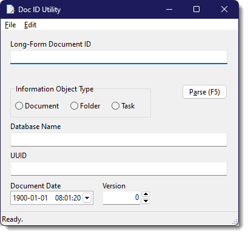

# Doc ID Decoder

This is a simple application that will decode the long-form UUID for a Doxis `IInformationObject` into its smaller parts:

1. Information Object Type
2. Database Name
3. Short UUID
4. Object Date
5. Version Number

The reason I created this tool was to quickly grab, for example, the URL from webCube of the object I was looking at to break down into the smaller pieces needed to properly query the object in the REST API.

## Using

Simply paste the long-form ID into the text box and run the parse function from the *File* menu, button, or *F5* shortcut.

There are some additional copy options on the Document Date field via the right-click context menu to copy the date in some various different formats.

## Planned Enhancements

1. Ability convert from the requisite components into the long-form UUID.
2. Binaries for macOS and Linux

## Building

**TODO**

This project is written in FreePascal and uses Lazarus for the GUI components. Building instructions will be available soon.